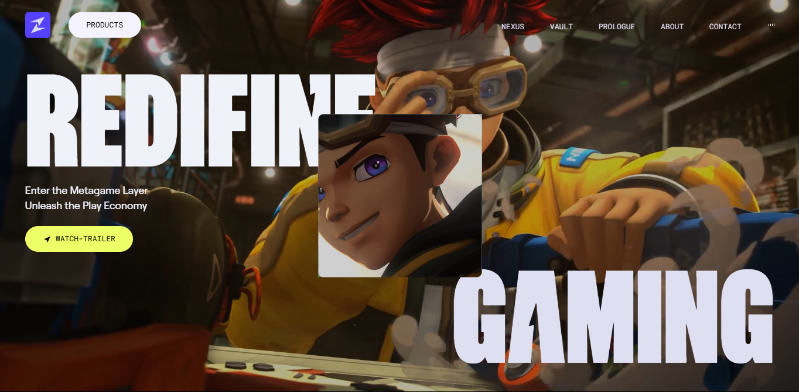

# **Zentry Clone – Modern Landing Page (React + TailwindCSS + GSAP)**  


🚀 A **high-performance, modern, and animated Zentry landing page clone** built using **React, TailwindCSS, and GSAP**. This project replicates Zentry’s sleek and futuristic UI with smooth animations and a fully responsive design.  

## ✨ **Features**  

- **📱 Fully Responsive** – Optimized for all devices and screen sizes.  
- **🎨 Sleek & Modern UI** – Inspired by Zentry’s futuristic design.  
- **⚡ High Performance** – Vite-powered for fast loading times.  
- **🎥 Smooth Animations** – Leveraging GSAP for stunning motion effects.  
- **🛠 TailwindCSS Styling** – Easy-to-customize utility-based styling.  


## 🖼️ **Preview**  
 

## 🛠 **Tech Stack**  

- **React** – Component-based frontend development.  
- **Vite** – Superfast and optimized build tool.  
- **TailwindCSS** – Utility-first CSS framework for styling.  
- **GSAP (GreenSock)** – For smooth animations and interactions.  

## 📦 **Getting Started**  

1️⃣ **Clone the repository:**  
```sh
git clone https://github.com/ben-bader/Zentry.git
```  

2️⃣ **Navigate to the project directory:**  
```sh
cd zentry-clone
```  

3️⃣ **Install dependencies:**  
```sh
npm install
```  

4️⃣ **Start the development server:**  
```sh
npm run dev
```  

5️⃣ **Open your browser and visit:**  
```sh
http://localhost:5173/
```  

## 🎨 **Customization**  

- Modify **TailwindCSS styles** for different color schemes and fonts.  
- Adjust **GSAP animations** for custom motion effects.  
- Add **API integrations** for dynamic content.  

## 🛠 **Contributing**  

Contributions are welcome! Feel free to fork the repository, submit pull requests, or report issues.  

## 📜 **License**  

This project is licensed under the **MIT License** – free to use and modify.  

